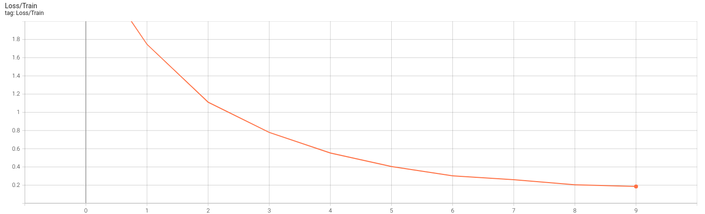
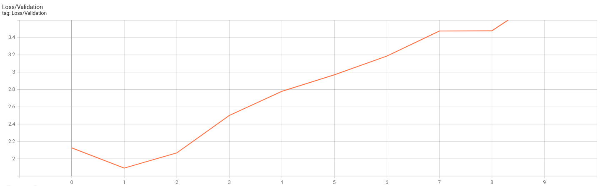
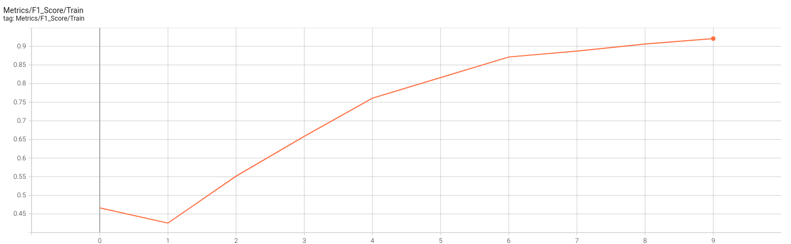
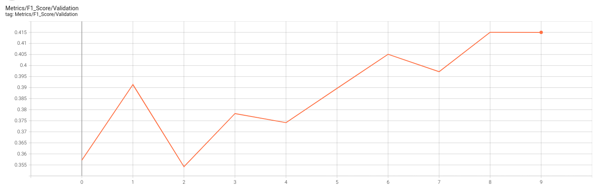

**SLURM Script**  

I used the following commands to train the model with one A100.  
srun --gres=gpu:1 --time=00:59:00 --mem=16G -c 32 --exclusive ---pty bash  
source $STORE/mypython/bin/activate

**Create a dataset**

The dataset I used is the dev-v2 dataset. It is a json file. I didn't know how to read this file, so I used a code from kaggle:  
https://www.kaggle.com/code/sanjay11100/squad-stanford-q-a-json-to-pandas-dataframe

This dataset can't be directly used for training. It must be tokenized first. 
I didn’t know how to do that, so I used code from ChatGPT, which I then modified.
To simplify the dataset, only the first 1600 rows and the first answer of each question have been kept.  
  
The model chosen for this task is the pre-trained bert base cased.  
The optimizer is AdamW which is similar the usual Adam optimizer but with weight decay. It seems that this kind of optimizer is better for transformer models.  
The learning rate at the beginning of the training is 5e-5 which is the usual learning rate for transformers.  

**Loss and Metrics**  

The default loss for this model is the binary cross entropy loss.    
To have something else from the loss to display on tensorboard I used the f1_score and an exact_match score.  
The f1_score wasn't imported from scikit_learn because to use it, the data must be in numpy array and not tensors. However, to get numpy arrays it seems that it is necessary to transfer my results from the GPU to the CPU.


**Training**
The training part is simple and only uses 2 loops, one to iterate epochs and another on to iterate through batches of each epochs. 

```python
for epoch in range(epochs):
    print(f"Epoch {epoch + 1}/{epochs}")
    model.train()

    total_loss_train = 0
    total_f1_train = 0
    num_questions_train = 0

    total_loss_validation = 0
    total_f1_validation = 0
    num_questions_validation = 0

    # Training Loop
    for batch in tqdm(train_dataloader, desc="Training"):
        input_ids = batch['input_ids'].to(device)
        attention_mask = batch['attention_mask'].to(device)
        start_positions = batch['start_positions'].to(device)
        end_positions = batch['end_positions'].to(device)

        optim.zero_grad()

        # Forward pass
        outputs = model(input_ids, attention_mask=attention_mask,
                        start_positions=start_positions, end_positions=end_positions)
        # Loss
        loss = outputs.loss
        total_loss_train += loss.item()

        # Backward pass and weight update
        loss.backward()
        optim.step()

        # Metric
        f1_batch, batch_size = compute_predictions_and_metrics(outputs, input_ids, start_positions, end_positions)
        total_f1_train += f1_batch
        num_questions_train += batch_size
```

**Results**
I have trained for 10 epochs.
The results at the end of the training are:  
Training Loss: 0.1853  
Validation Loss: 3.879
Training F1 Score: 0.9028
Validation F1 Score: 0.415
The time for the training is: 8:15 with an average time of 50 seconds for each epoch, for the training steps, according to tensorboard.  
After the 2nd epoch, the model has overfitted, this is certainly due to the low amount of data.




